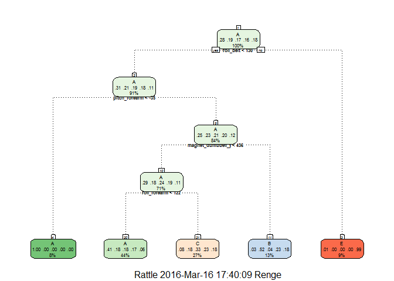

# Practical Machine Learning Course project
Patrick Talley  
March 16, 2016  


# Load the data and libraries


```r
library(caret)
```

```
## Warning: package 'caret' was built under R version 3.2.4
```

```
## Loading required package: lattice
```

```
## Loading required package: ggplot2
```

```r
library(rpart)
library(ggplot2)
library(rpart.plot)
```

```
## Warning: package 'rpart.plot' was built under R version 3.2.4
```

```r
library(RColorBrewer)
library(rattle)
```

```
## Warning: package 'rattle' was built under R version 3.2.4
```

```
## Rattle: A free graphical interface for data mining with R.
## Version 4.1.0 Copyright (c) 2006-2015 Togaware Pty Ltd.
## Type 'rattle()' to shake, rattle, and roll your data.
```

```r
library(randomForest)
```

```
## randomForest 4.6-12
```

```
## Type rfNews() to see new features/changes/bug fixes.
```

```
## 
## Attaching package: 'randomForest'
```

```
## The following object is masked from 'package:ggplot2':
## 
##     margin
```

```r
library(gridExtra)
```

```
## Warning: package 'gridExtra' was built under R version 3.2.4
```

```
## 
## Attaching package: 'gridExtra'
```

```
## The following object is masked from 'package:randomForest':
## 
##     combine
```

```r
setwd("D:/Documents/CourseraR/machineLearning")
set.seed(1234)
training <- read.csv("pml-training.csv", na.strings = c("NA",""))
test <- read.csv("pml-testing.csv", na.strings = c("NA",""))
```

#Loading and cleaning data

Because the first 6 were index, name and time variable they were ignored for the prediction.


```r
inTrain <- createDataPartition(y=training$classe, p=0.6, list=FALSE)
train <- training[inTrain, -c(1:6)]
cval <- training[-inTrain, ]
```

Create a subset without NZV


```r
myDataNZV <- nearZeroVar(train, saveMetrics=TRUE)
nameNZM <- row.names(myDataNZV[which(myDataNZV$nzv == TRUE, arr.ind = T),])
trainNZV <- names(train) %in% nameNZM
subtrain <- train[!trainNZV]
```

There were columns with large number of NAs so I removed those columns


```r
avgna <- function(x) {
    n <- length(x)
    na.count <- sum(is.na(x))
    return((n - na.count)/n)
}

nacols <- apply(subtrain, 2, avgna)
subtrain <- subtrain[, nacols > 0.9]
```

#Rpart model


```r
set.seed(1234)
rpartMod <- train(classe~., method = "rpart", data = subtrain)
print(rpartMod$finalModel)
```

```
## n= 11776 
## 
## node), split, n, loss, yval, (yprob)
##       * denotes terminal node
## 
##  1) root 11776 8428 A (0.28 0.19 0.17 0.16 0.18)  
##    2) roll_belt< 130.5 10774 7436 A (0.31 0.21 0.19 0.18 0.11)  
##      4) pitch_forearm< -34.55 919    2 A (1 0.0022 0 0 0) *
##      5) pitch_forearm>=-34.55 9855 7434 A (0.25 0.23 0.21 0.2 0.12)  
##       10) magnet_dumbbell_y< 436.5 8314 5944 A (0.29 0.18 0.24 0.19 0.11)  
##         20) roll_forearm< 122.5 5137 3022 A (0.41 0.18 0.18 0.17 0.061) *
##         21) roll_forearm>=122.5 3177 2124 C (0.08 0.18 0.33 0.23 0.18) *
##       11) magnet_dumbbell_y>=436.5 1541  743 B (0.033 0.52 0.039 0.23 0.18) *
##    3) roll_belt>=130.5 1002   10 E (0.01 0 0 0 0.99) *
```


```r
fancyRpartPlot(rpartMod$finalModel,cex=.5,under.cex=1,shadow.offset=0)
```




```r
classepredict=predict(rpartMod,cval)
confusionMatrix(cval$classe,classepredict)
```

```
## Confusion Matrix and Statistics
## 
##           Reference
## Prediction    A    B    C    D    E
##          A 2029   44  155    0    4
##          B  638  505  375    0    0
##          C  644   49  675    0    0
##          D  567  232  487    0    0
##          E  209  211  383    0  639
## 
## Overall Statistics
##                                           
##                Accuracy : 0.4904          
##                  95% CI : (0.4793, 0.5016)
##     No Information Rate : 0.5209          
##     P-Value [Acc > NIR] : 1               
##                                           
##                   Kappa : 0.3339          
##  Mcnemar's Test P-Value : NA              
## 
## Statistics by Class:
## 
##                      Class: A Class: B Class: C Class: D Class: E
## Sensitivity            0.4965  0.48511  0.32530       NA  0.99378
## Specificity            0.9460  0.85114  0.87992   0.8361  0.88852
## Pos Pred Value         0.9091  0.33267  0.49342       NA  0.44313
## Neg Pred Value         0.6334  0.91530  0.78388       NA  0.99938
## Prevalence             0.5209  0.13268  0.26447   0.0000  0.08195
## Detection Rate         0.2586  0.06436  0.08603   0.0000  0.08144
## Detection Prevalence   0.2845  0.19347  0.17436   0.1639  0.18379
## Balanced Accuracy      0.7212  0.66812  0.60261       NA  0.94115
```

This model did not work well for prediction so the random forest was looked at next because it is able to handle higher number of variables better than rpart.

#Random Forest Model

Random forest with 4 fold cross-validation


```r
rfMod <- train(classe ~., method = "rf",
               trControl=trainControl(method = "cv", number = 4), 
               data=subtrain)

print(rfMod)
```

```
## Random Forest 
## 
## 11776 samples
##    53 predictor
##     5 classes: 'A', 'B', 'C', 'D', 'E' 
## 
## No pre-processing
## Resampling: Cross-Validated (4 fold) 
## Summary of sample sizes: 8832, 8832, 8831, 8833 
## Resampling results across tuning parameters:
## 
##   mtry  Accuracy   Kappa      Accuracy SD  Kappa SD   
##    2    0.9913381  0.9890424  0.001507779  0.001907032
##   27    0.9954142  0.9941991  0.001161323  0.001469740
##   53    0.9928665  0.9909762  0.001689054  0.002138675
## 
## Accuracy was used to select the optimal model using  the largest value.
## The final value used for the model was mtry = 27.
```


```r
varImp(rfMod)
```

```
## rf variable importance
## 
##   only 20 most important variables shown (out of 53)
## 
##                      Overall
## num_window           100.000
## roll_belt             69.526
## pitch_forearm         43.463
## yaw_belt              35.885
## magnet_dumbbell_y     33.046
## pitch_belt            30.347
## magnet_dumbbell_z     29.956
## roll_forearm          26.586
## accel_dumbbell_y      13.831
## roll_dumbbell         13.153
## accel_forearm_x       11.141
## magnet_dumbbell_x     10.630
## accel_belt_z           9.778
## total_accel_dumbbell   9.767
## accel_dumbbell_z       9.687
## magnet_belt_z          8.587
## magnet_belt_y          8.318
## magnet_forearm_z       8.100
## magnet_belt_x          6.433
## yaw_dumbbell           5.612
```


```r
classepredict2=predict(rfMod,cval)
confusionMatrix(cval$classe,classepredict2)
```

```
## Confusion Matrix and Statistics
## 
##           Reference
## Prediction    A    B    C    D    E
##          A 2232    0    0    0    0
##          B    5 1510    3    0    0
##          C    0    4 1363    1    0
##          D    0    0    7 1279    0
##          E    0    3    0    3 1436
## 
## Overall Statistics
##                                           
##                Accuracy : 0.9967          
##                  95% CI : (0.9951, 0.9978)
##     No Information Rate : 0.2851          
##     P-Value [Acc > NIR] : < 2.2e-16       
##                                           
##                   Kappa : 0.9958          
##  Mcnemar's Test P-Value : NA              
## 
## Statistics by Class:
## 
##                      Class: A Class: B Class: C Class: D Class: E
## Sensitivity            0.9978   0.9954   0.9927   0.9969   1.0000
## Specificity            1.0000   0.9987   0.9992   0.9989   0.9991
## Pos Pred Value         1.0000   0.9947   0.9963   0.9946   0.9958
## Neg Pred Value         0.9991   0.9989   0.9985   0.9994   1.0000
## Prevalence             0.2851   0.1933   0.1750   0.1635   0.1830
## Detection Rate         0.2845   0.1925   0.1737   0.1630   0.1830
## Detection Prevalence   0.2845   0.1935   0.1744   0.1639   0.1838
## Balanced Accuracy      0.9989   0.9971   0.9960   0.9979   0.9995
```

This model did a much better job at predicting the cross validation set therefore it was used for the final test set for prediction.


```r
testinganswers=predict(rfMod, newdata=test)
print(testinganswers)
```

```
##  [1] B A B A A E D B A A B C B A E E A B B B
## Levels: A B C D E
```
